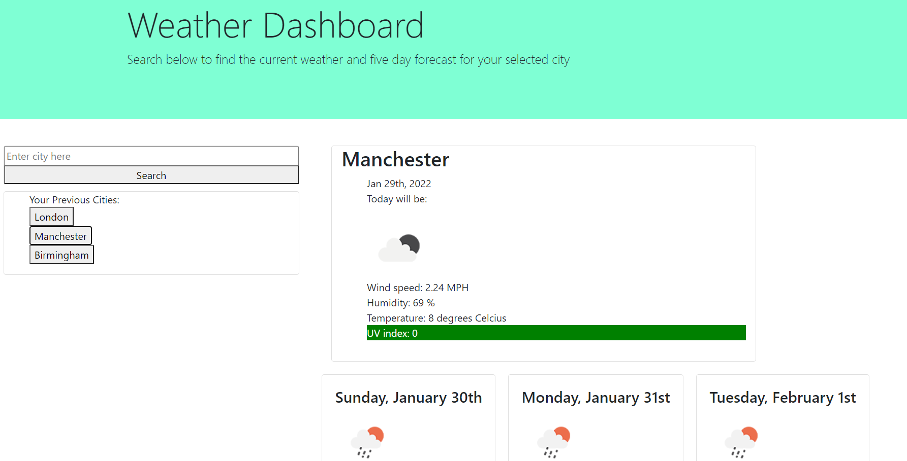

# Homework 6: Weather Dashboard

This project uses the Open Weather one-call API to retrieve the current and five-day weather forecast for a city of the user's choosing. The acceptance criteria for the project were as follows:

```
WHEN I search for a city
THEN I am presented with current and future conditions for that city and that city is added to the search history

WHEN I view current weather conditions for that city
THEN I am presented with the city name, the date, an icon representation of weather conditions, the temperature, the humidity,
the wind speed, and the UV index

WHEN I view the UV index
THEN I am presented with a color that indicates whether the conditions are favorable, moderate, or severe

WHEN I view future weather conditions for that city
THEN I am presented with a 5-day forecast that displays the date, an icon representation of weather conditions, the temperature,
the wind speed, and the humidity

WHEN I click on a city in the search history
THEN I am again presented with current and future conditions for that city
```

Below shows a screenshot of the completed application:


The link to the project is as follows: https://empipio.github.io/h6-weather-dashboard/
